

  

  # LOAM

  ### Your worlds, ready.

  
A calm, lightweight Windows launcher for Minecraft Java Edition. Native Rust core. No ads. No telemetry. No companion apps.

  

    <a href="https://github.com/majordhyan/loam-launcher/releases/latest/download/LOAM-Setup-Windows-x64.exe"><strong>Download for Windows</strong></a> &nbsp;·&nbsp;
    <a href="https://loamlauncher.app/"><strong>Website</strong></a> &nbsp;·&nbsp;
    <a href="CHANGELOG.md"><strong>What's new in 1.9.0</strong></a> &nbsp;·&nbsp;
    <a href="https://discord.gg/7ft7ZJ9brd"><strong>Discord</strong></a>
  

  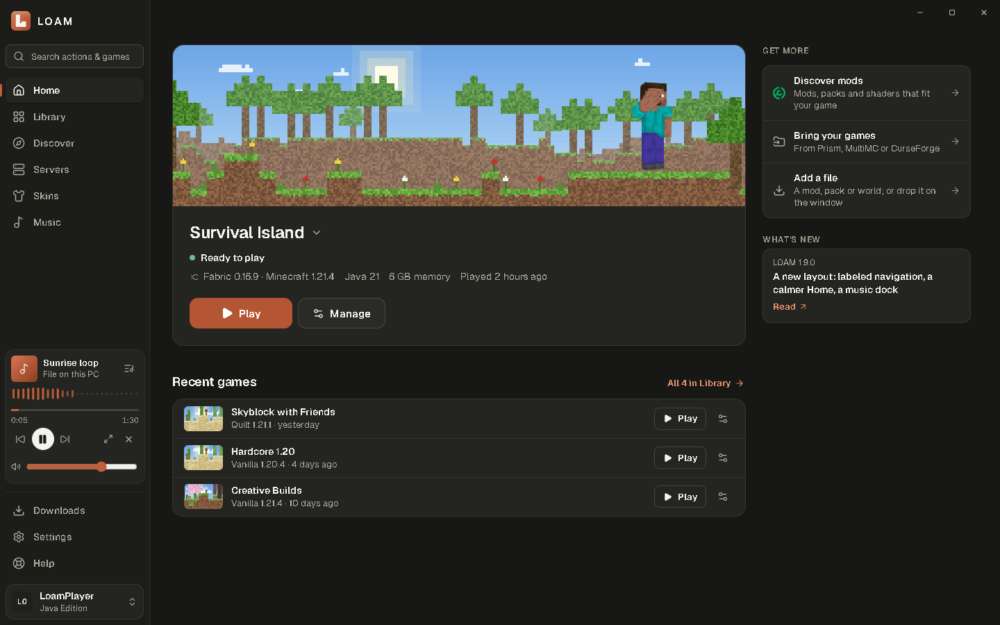

---

> **Current release: v1.9.0** · Windows 10/11 x64 · 5.4 MB installer · [Release notes](https://github.com/majordhyan/loam-launcher/releases/tag/v1.9.0)

## Why LOAM?

Tired of bloated, ad-heavy launchers that crawl on startup? LOAM is a Swiss-designed Minecraft launcher for players who value speed, privacy and a calm screen.

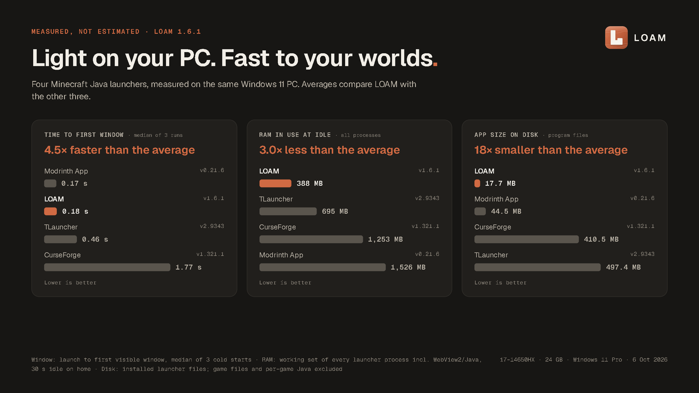

Measured with LOAM 1.6.1 on one Windows 11 PC (i7-14650HX, 24 GB) on 6 Oct 2026. Median of three cold starts; RAM includes every process of each launcher. Modrinth App opened its window 7 ms sooner than LOAM. Raw data and method: <a href="docs/performance.md">docs/performance.md</a>. An idle LOAM 1.9 does almost no work: under 1 ms of main-thread time per second on Home, Servers and Skins.

## What's new in 1.9.0

A redesign of the whole app around one idea: the next action should be obvious, and everything else should be easy to find. 1.9.0 also brings everything from 1.7 and 1.8.

| | |
| :--- | :--- |
| **A new layout** | A labeled sidebar (Home, Library, Discover, Servers, Skins, Music), with Downloads, Settings, Help and your account always one click away. Home leads with your selected game and one Play button. Dark, Light and OLED Black themes. |
| **Discover mods, packs and shaders** | Browse Modrinth (and CurseForge with your own free API key): mods, modpacks, resource & texture packs and shaders. Filter by category, Minecraft version, loader and installed state. Each project shows its licence, links and every compatible version, with the recommended one marked. |
| **Installs you can trust** | Before anything downloads, LOAM lists every file, where it goes (`mods`, `resourcepacks`, `shaderpacks`) and which required mods come with it. Shaders bring Iris and Sodium when your game needs them. Every file is checksum-verified; Cancel works at any point, and a failed install changes nothing. |
| **Servers** | 32 popular servers by game mode (BedWars, SkyBlock, Survival, Lifesteal and more), with live status, players, ping and version. Join starts your game straight into the server. Add your own; filter for servers that accept offline profiles. |
| **Music while you build** | YouTube and YouTube Music play in LOAM, through YouTube's own privacy-enhanced player. Files from your PC play with a real spectrum. Spotify, Apple Music and SoundCloud links are saved and open in their own apps. One compact player sits in the sidebar and keeps playing as you move around. |
| **Skins** | A calm 3D stage that always says where your look is: a preview, saved in LOAM, or on your Microsoft account. The new default LOAM Field skin and cape. |
| **Updates from Settings** | LOAM checks its releases, shows what's new and installs signed updates itself. |

<table>
  <tr>
    <td width="50%">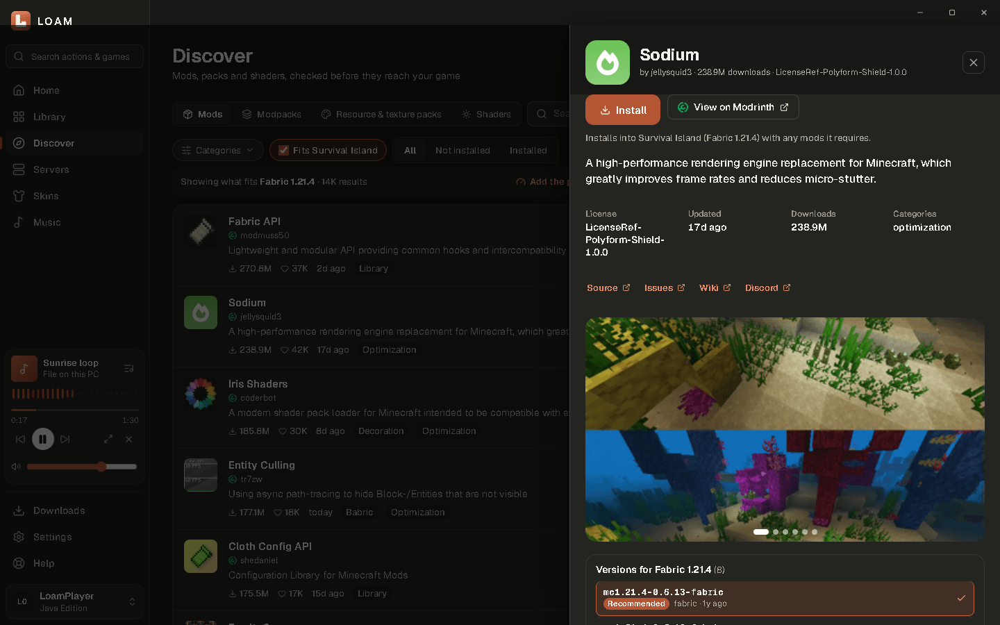</td>
    <td width="50%">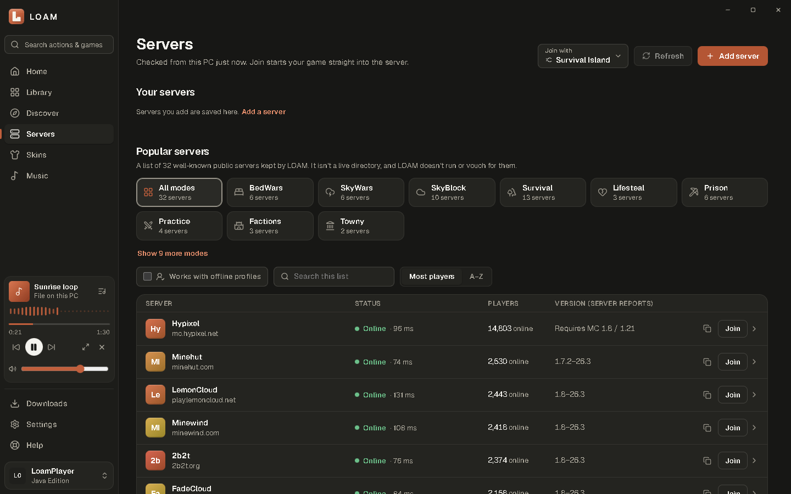</td>
  </tr>
  <tr>
    <td align="center">Discover: details, versions and what will be installed</td>
    <td align="center">Servers by game mode</td>
  </tr>
  <tr>
    <td width="50%">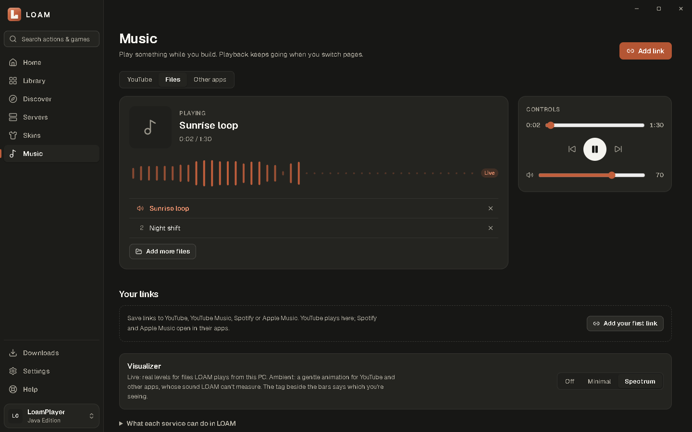</td>
    <td width="50%">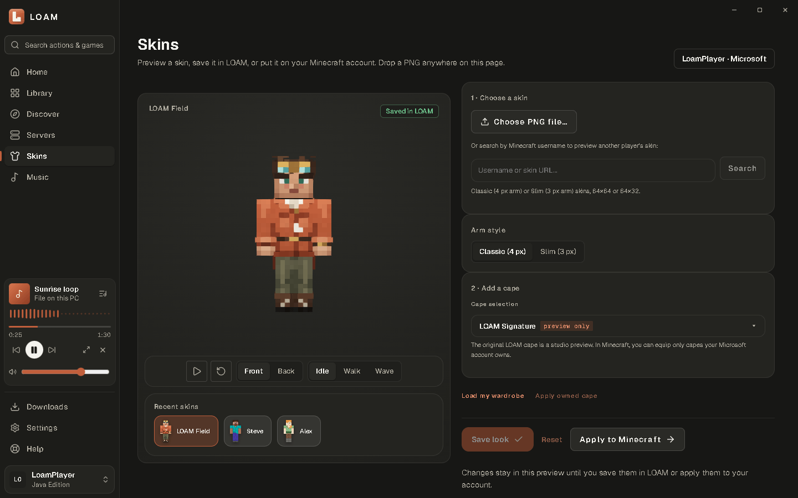</td>
  </tr>
  <tr>
    <td align="center">Music: files with a live spectrum, YouTube and saved links</td>
    <td align="center">Skins, with the new LOAM Field skin</td>
  </tr>
  <tr>
    <td width="50%">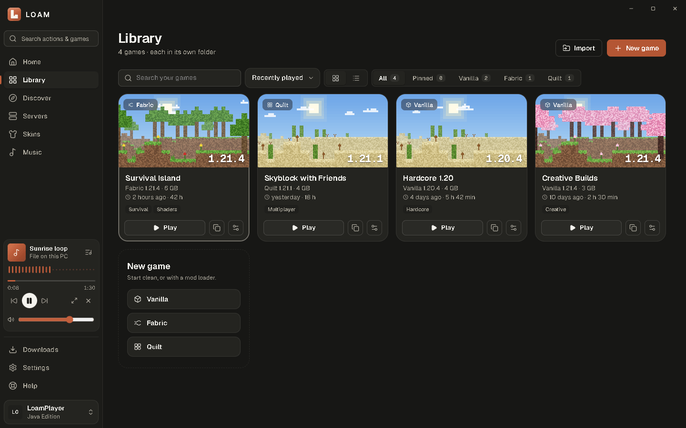</td>
    <td width="50%">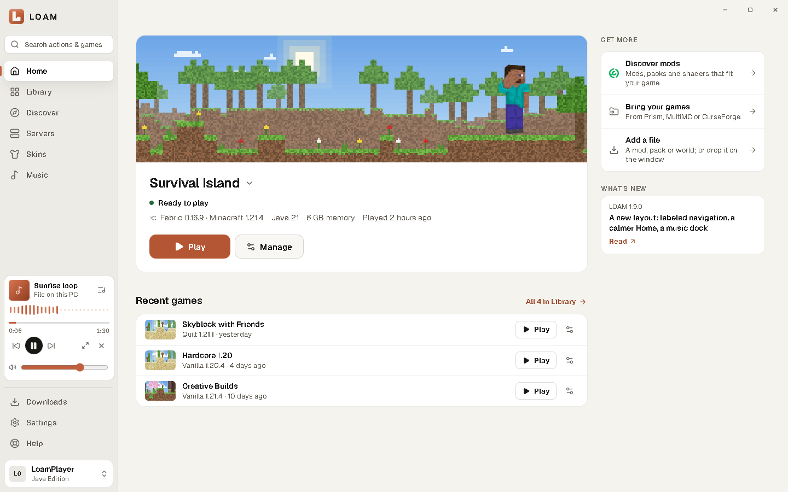</td>
  </tr>
  <tr>
    <td align="center">Library</td>
    <td align="center">Light theme (also Dark and OLED Black)</td>
  </tr>
</table>

## Everything else

- **Isolated games.** Every game has its own folder, saves, mods, packs and settings. Pin, tag, duplicate, and see playtime.
- **Official files, verified.** Minecraft comes from Mojang's servers; every file is checked against its published hash before use. Interrupted downloads resume.
- **Java handled for you.** LOAM installs the Eclipse Temurin version each Minecraft version asks for.
- **Migration Hub and Smart Drop.** Bring Prism Launcher, MultiMC and CurseForge instances over in one step, or drop a mod, pack, world or folder anywhere on the window.
- **Crashes, explained.** LOAM reads the game's log on your PC and explains the cause in one sentence, with a one-click fix.
- **Live Minecraft news**, release and snapshot notes inside LOAM.
- **System tray.** Keep LOAM in the corner while you play.
- **Keyboard first.** `Ctrl K` for every action, `Alt 1`–`Alt 6` for the main places, `F1` for help. Reduced-motion support, and the automated WCAG 2.2 AA check (axe-core) passes on every page in Dark and Light.
- **Private reports.** Problem reports are built and previewed on your PC; nothing is uploaded.

<table>
  <tr>
    <td width="33%">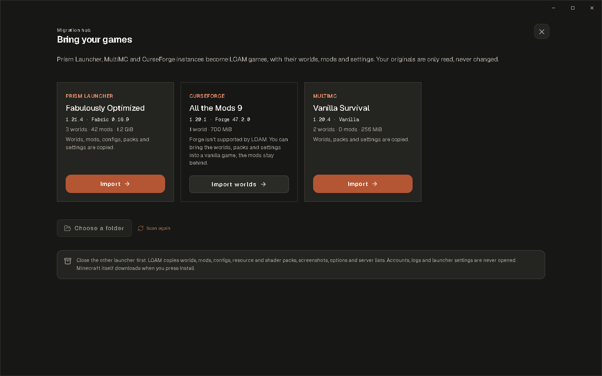</td>
    <td width="33%">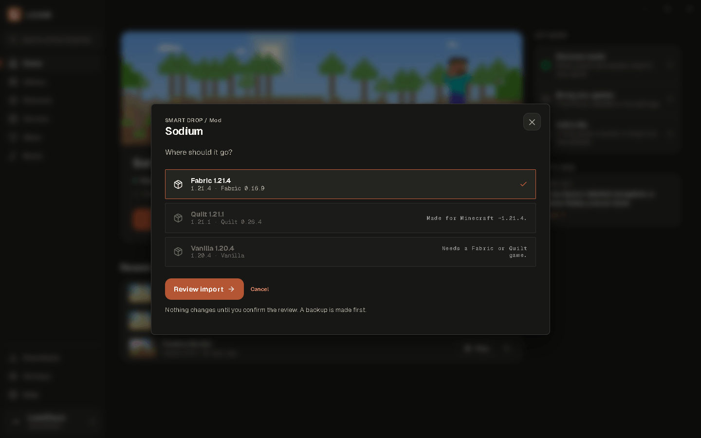</td>
    <td width="33%">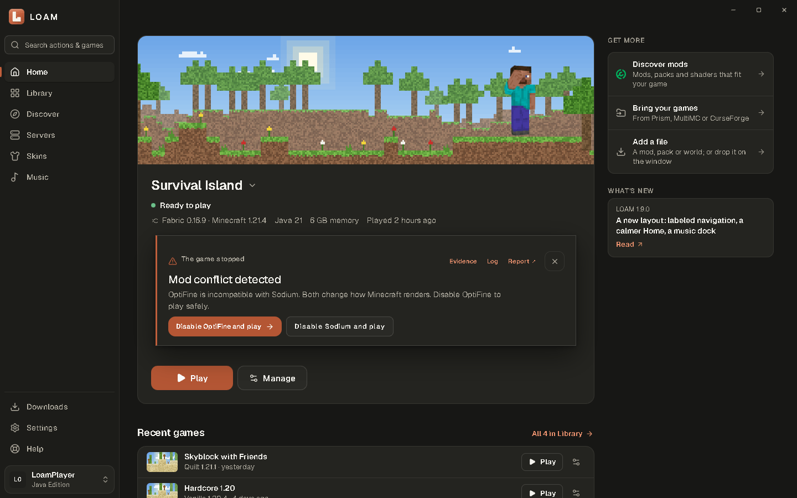</td>
  </tr>
  <tr>
    <td align="center">Migration Hub</td>
    <td align="center">Smart Drop</td>
    <td align="center">Crash decoder</td>
  </tr>
</table>

## Download & install

1. Download [**LOAM-Setup-Windows-x64.exe**](https://github.com/majordhyan/loam-launcher/releases/latest/download/LOAM-Setup-Windows-x64.exe) and `SHA256SUMS.txt` from the [latest release](https://github.com/majordhyan/loam-launcher/releases/latest).
2. Check the file: `certutil -hashfile LOAM-Setup-Windows-x64.exe SHA256` must print the value in `SHA256SUMS.txt`.
3. Run it. No administrator rights are needed. LOAM is **not code-signed yet**, so Windows SmartScreen shows "Windows protected your PC": choose **More info → Run anyway** after checking the hash.
4. Sign in with Microsoft, create an Offline Profile, or bring your games over from another launcher.

**Upgrading from 1.5 or 1.6:** run the 1.9.0 installer once; your games, worlds and settings are kept. From then on LOAM updates itself from **Settings › Updates**, and only installs updates signed with LOAM's key. Details: [Installation](docs/installation.md).

| Requirement | |
| :--- | :--- |
| Windows | 10 or 11, 64-bit (x64) |
| WebView2 | Built into Windows 11; the installer fetches it on Windows 10 if missing |
| Disk | About 20 MB for LOAM; about 0.5–1 GB per Minecraft version, shared files counted once |
| Internet | To install games, sign in, browse content and play music from YouTube |

## Compatibility

| | Supported |
| :--- | :--- |
| **Minecraft** | Java Edition **1.16.1 and newer** releases, up to the latest (26.x); snapshots optional |
| **Loaders** | **Vanilla**, **Fabric**, **Quilt** |
| **Content** | Modrinth mods, modpacks, resource & texture packs and shaders; CurseForge mods with your own API key |
| **Imports** | Fabric/Quilt mods (`.jar`), resource and shader packs, world `.zip`, Modrinth `.mrpack` and links, Prism / MultiMC / CurseForge instances, `.minecraft` folders |
| **Not supported** | Forge, NeoForge, OptiFine as a loader, Bedrock Edition, versions before 1.16.1, CurseForge modpacks. Forge/NeoForge instances can bring their worlds and packs into a vanilla game. |

Full matrix: [docs/compatibility.md](docs/compatibility.md).

## Accounts

| | Microsoft account | Offline Profile |
| :--- | :---: | :---: |
| Singleplayer and LAN | ✅ | ✅ |
| Offline-mode servers | ✅ | ✅ |
| Online servers and Realms | ✅ | — |
| Proves you own Java Edition (including Xbox Game Pass) | ✅ | — |
| Your skin in game | ✅ Seen by everyone | Seen only by you (local resource pack) |
| Official capes | ✅ Ones you own | — |

Your Microsoft password is entered on Microsoft's own page in your browser; LOAM never sees it. The sign-in token is kept in Windows Credential Manager.

## Documentation

[Installation](docs/installation.md) · [First run](docs/first-run.md) · [Importing & Migration Hub](docs/importing.md) · [Compatibility](docs/compatibility.md) · [Troubleshooting & crash decoder](docs/troubleshooting.md) · [FAQ](docs/faq.md) · [Performance](docs/performance.md) · [Uninstall & data](docs/uninstall-and-data.md) · [Privacy](PRIVACY.md)

## Support

- **Bugs:** [open a bug report](https://github.com/majordhyan/loam-launcher/issues/new?template=bug_report.yml). Press `F1` in LOAM to prepare a redacted report first.
- **Ideas:** [request a feature](https://github.com/majordhyan/loam-launcher/issues/new?template=feature_request.yml)
- **Chat:** [Discord](https://discord.gg/7ft7ZJ9brd) · **Email:** loamlauncher@gmail.com
- **Security issues:** report privately, see [SECURITY.md](SECURITY.md)

## Privacy

No ads, no telemetry, no analytics, no LOAM account. LOAM only talks to the services a feature needs: Mojang and Microsoft to install, sign in and play; Fabric, Quilt and Eclipse Adoptium for loaders and Java; Modrinth (and CurseForge, if you add a key) in Discover; the servers you look at, to show their status; YouTube when you play music from it; and GitHub to check for LOAM updates. LOAM never listens to your PC's sound. The full list is in [PRIVACY.md](PRIVACY.md).

## About this repository

This repository hosts LOAM's releases, documentation and issue tracker. LOAM is proprietary, closed-source software, free to download and use under the [LOAM license](LICENSE). The source code is not published.

LOAM is an independent launcher, not affiliated with, endorsed by, or connected to Mojang Studios or Microsoft. Minecraft® is a trademark of Mojang Synergies AB. YouTube, Spotify, Apple Music, SoundCloud, Modrinth and CurseForge are trademarks of their owners.

© 2026 LOAM. All rights reserved.

