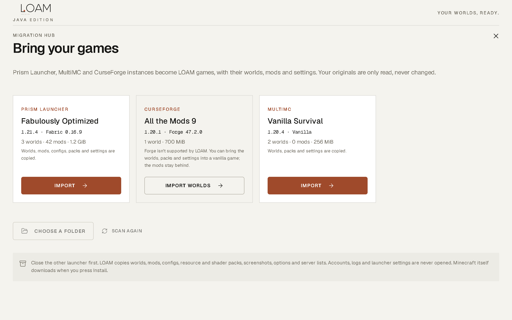
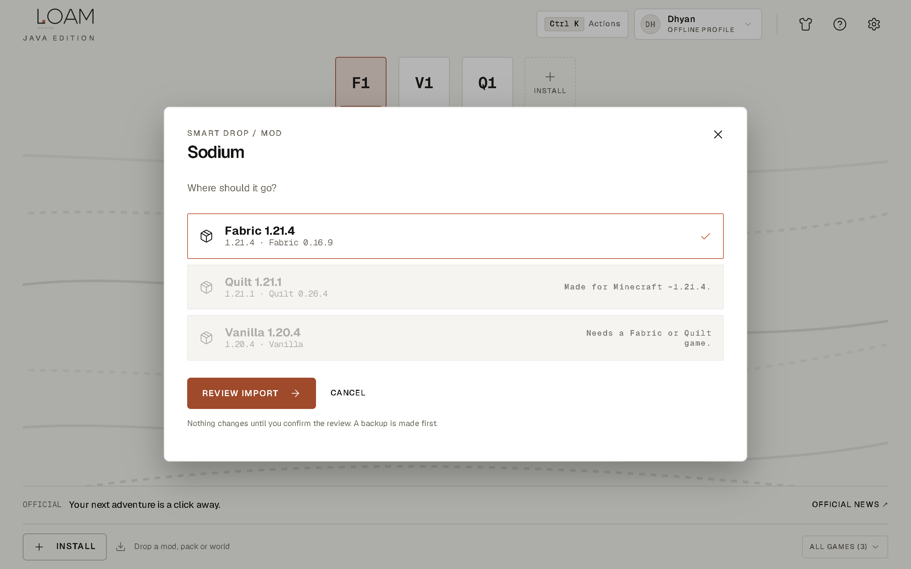

  

  ### Your worlds, ready.

  
A calm, lightweight Windows launcher for Minecraft Java Edition. Native Rust core. No ads. No telemetry. No companion apps.

  

    <a href="https://github.com/majordhyan/loam-launcher/releases/latest/download/LOAM-Setup-Windows-x64.exe"><strong>Download for Windows</strong></a> &nbsp;·&nbsp;
    <a href="https://loamlauncher.app/"><strong>Website</strong></a> &nbsp;·&nbsp;
    <a href="CHANGELOG.md"><strong>What's new in 1.6.1</strong></a> &nbsp;·&nbsp;
    <a href="https://discord.gg/7ft7ZJ9brd"><strong>Discord</strong></a>
  

  

---

> **Current release: v1.6.1** · Windows 10/11 x64 · 4.6 MB installer · [Release notes](https://github.com/majordhyan/loam-launcher/releases/tag/v1.6.1)

## Why LOAM?

Tired of bloated, ad-heavy launchers that crawl on startup? LOAM is a Swiss-designed Minecraft launcher for players who value speed, privacy and a calm screen.

Measured on one Windows 11 PC (i7-14650HX, 24 GB) on 6 Oct 2026. Median of three cold starts; RAM includes every process of each launcher. Modrinth App opened its window 7 ms sooner than LOAM. Raw data and method: <a href="docs/performance.md">docs/performance.md</a>.

## What's new in 1.6.1

| | |
| :--- | :--- |
| **Migration Hub** | Bring your Prism Launcher, MultiMC and CurseForge instances over in one step: worlds, mods, configs, resource and shader packs, screenshots, options and server lists. Fabric or Quilt and the memory setting carry over. Your originals are only read, never changed. |
| **Smart Drop, anywhere** | Drop a mod, pack, world or instance folder anywhere on the window. LOAM checks it against every game, tells you why one can't take it, and picks the best match. Modrinth packs can create their own matching game. |
| **Crashes, explained** | When Minecraft stops, LOAM reads the log on your PC and explains the cause in one sentence, with a fix you can apply in one click: *"Iris needs Sodium (0.6.x). Add Sodium, or disable Iris."* |
| **Your head, your account** | Microsoft accounts show your Minecraft head and a **Java Edition ✓** check, confirmed again at every launch. Sign-in is one browser page, then LOAM comes back to the front. |
| **Fixed** | Minecraft 1.17–1.20.4 start again (1.5.x passed a Java option those versions reject). 1.17 and 1.17.1 can be installed again. |

<table>
  <tr>
    <td width="33%"></td>
    <td width="33%"></td>
    <td width="33%"></td>
  </tr>
  <tr>
    <td align="center">Migration Hub</td>
    <td align="center">Smart Drop</td>
    <td align="center">Crash decoder</td>
  </tr>
</table>

## Everything else

- **Isolated games.** Every game has its own folder, saves, mods, packs and settings.
- **Official files, verified.** Minecraft comes from Mojang's servers; every file is checked against its published hash before use. Interrupted downloads resume.
- **Java handled for you.** LOAM installs the Eclipse Temurin version each Minecraft version asks for.
- **Reviewed imports with backups.** Nothing changes until you confirm, and a backup is made first. Restore it from the game's Backups tab.
- **Skin studio.** 3D preview, local PNG or player-name lookup; official skin and cape changes for Microsoft accounts.
- **Keyboard first.** `Ctrl K` for every action, `Ctrl ↵` to play, `F1` for help. Light and dark themes, reduced-motion support.
- **Private reports.** Problem reports are built and previewed on your PC; nothing is uploaded.

## Download & install

1. Download [**LOAM-Setup-Windows-x64.exe**](https://github.com/majordhyan/loam-launcher/releases/latest/download/LOAM-Setup-Windows-x64.exe) and `SHA256SUMS.txt` from the [latest release](https://github.com/majordhyan/loam-launcher/releases/latest).
2. Check the file: `certutil -hashfile LOAM-Setup-Windows-x64.exe SHA256` must print the value in `SHA256SUMS.txt`.
3. Run it. No administrator rights are needed. LOAM 1.6.1 is **not code-signed yet**, so Windows SmartScreen shows "Windows protected your PC": choose **More info → Run anyway** after checking the hash.
4. Sign in with Microsoft, create an Offline Profile, or bring your games over from another launcher.

Upgrading keeps your games, worlds and settings. Details: [Installation](docs/installation.md).

| Requirement | |
| :--- | :--- |
| Windows | 10 or 11, 64-bit (x64) |
| WebView2 | Built into Windows 11; the installer fetches it on Windows 10 if missing |
| Disk | 18 MB for LOAM; about 0.5–1 GB per Minecraft version, shared files counted once |
| Internet | To install games, sign in and download content |

## Compatibility

| | Supported |
| :--- | :--- |
| **Minecraft** | Java Edition **1.16.1 and newer** releases, up to the latest (26.x); snapshots optional |
| **Loaders** | **Vanilla**, **Fabric**, **Quilt** |
| **Imports** | Fabric/Quilt mods (`.jar`), resource and shader packs, world `.zip`, Modrinth `.mrpack` and links, Prism / MultiMC / CurseForge instances, `.minecraft` folders |
| **Not supported** | Forge, NeoForge, OptiFine as a loader, Bedrock Edition, versions before 1.16.1. Forge/NeoForge instances can bring their worlds and packs into a vanilla game. |

Full matrix: [docs/compatibility.md](docs/compatibility.md).

## Accounts

| | Microsoft account | Offline Profile |
| :--- | :---: | :---: |
| Singleplayer and LAN | ✅ | ✅ |
| Offline-mode servers | ✅ | ✅ |
| Online servers and Realms | ✅ | — |
| Proves you own Java Edition | ✅ | — |
| Your skin in game | ✅ Seen by everyone | Seen only by you (local resource pack) |
| Official capes | ✅ Ones you own | — |

Your Microsoft password is entered on Microsoft's own page in your browser; LOAM never sees it. The sign-in token is kept in Windows Credential Manager.

## Documentation

[Installation](docs/installation.md) · [First run](docs/first-run.md) · [Importing & Migration Hub](docs/importing.md) · [Compatibility](docs/compatibility.md) · [Troubleshooting & crash decoder](docs/troubleshooting.md) · [FAQ](docs/faq.md) · [Performance](docs/performance.md) · [Uninstall & data](docs/uninstall-and-data.md) · [Privacy](PRIVACY.md)

## Support

- **Bugs:** [open a bug report](https://github.com/majordhyan/loam-launcher/issues/new?template=bug_report.yml). Press `F1` in LOAM to prepare a redacted report first.
- **Ideas:** [request a feature](https://github.com/majordhyan/loam-launcher/issues/new?template=feature_request.yml)
- **Chat:** [Discord](https://discord.gg/7ft7ZJ9brd) · **Email:** loamlauncher@gmail.com
- **Security issues:** report privately, see [SECURITY.md](SECURITY.md)

## Privacy

No ads, no telemetry, no analytics, no LOAM account. LOAM only talks to the services needed to install and run Minecraft (Mojang, Microsoft for sign-in, Fabric, Quilt, Modrinth when you use it, and Eclipse Adoptium for Java). The full list is in [PRIVACY.md](PRIVACY.md).

## About this repository

This repository hosts LOAM's releases, documentation and issue tracker. LOAM is proprietary, closed-source software, free to download and use under the [LOAM license](LICENSE).

LOAM is an independent launcher, not affiliated with, endorsed by, or connected to Mojang Studios or Microsoft. Minecraft® is a trademark of Mojang Synergies AB.

© 2026 LOAM. All rights reserved.

