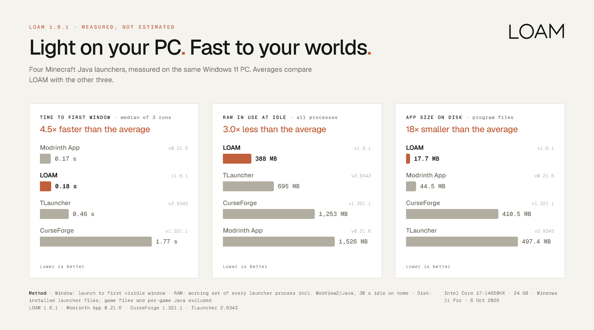

# Performance

How LOAM 1.6.1 compares with other Minecraft launchers, and exactly how it was measured.

## Results (median of three runs)

| Launcher | Version | First window | RAM in use at idle | Processes | App size on disk |
| :--- | :--- | ---: | ---: | ---: | ---: |
| **LOAM** | 1.6.1 | **0.18 s** | **388 MB** | 6 | **17.7 MB** |
| Modrinth App | 0.21.6 | 0.17 s | 1,526 MB | 21 | 44.5 MB |
| TLauncher | 2.9343 | 0.46 s | 695 MB | 1 | 497.4 MB |
| CurseForge | 1.321.1 | 1.77 s | 1,253 MB | 8 | 410.5 MB |

Against the average of the other three, LOAM opened its window 4.5× faster, used 3.0× less RAM and took 18× less disk space. Modrinth App opened its window 7 ms sooner than LOAM; that is within run-to-run variation. TLauncher runs as a single Java process.

## Method

- **Machine:** Intel Core i7-14650HX, 24 GB RAM, Windows 11 Pro, 6 October 2026. Each launcher was already installed and opened with its existing settings.
- **Runs:** each launcher was started cold three times, in rotating order, with every launcher closed before each run. Medians are reported.
- **First window:** time from starting the executable to the first visible top-level window with a title. This measures how fast the app appears, not how fast every part of its screen has loaded.
- **RAM in use at idle:** total working set of every process belonging to the launcher (including its WebView2 or Java processes), 30 seconds after the window appeared, left on its home screen.
- **App size on disk:** the launcher's installed program files. Game files, per-game Java and caches are excluded. TLauncher includes its `starter` folder, which holds the Java runtime it needs to run.
- **Not measured:** in-game frame rates, which depend mostly on Minecraft, your mods and your hardware.

Raw results: [benchmark-2026-10-06.json](benchmark-2026-10-06.json). Results on other PCs will differ; the relative order is what matters.

*Back to [README](../README.md)*
