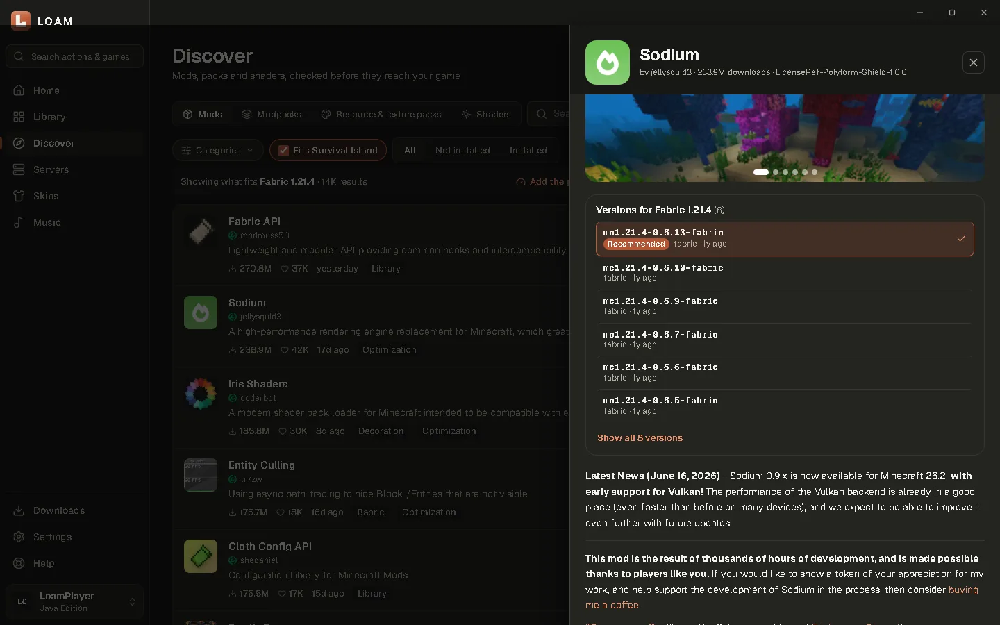
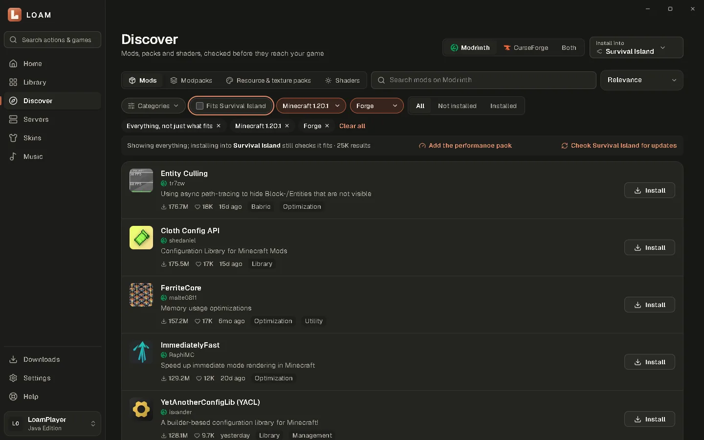
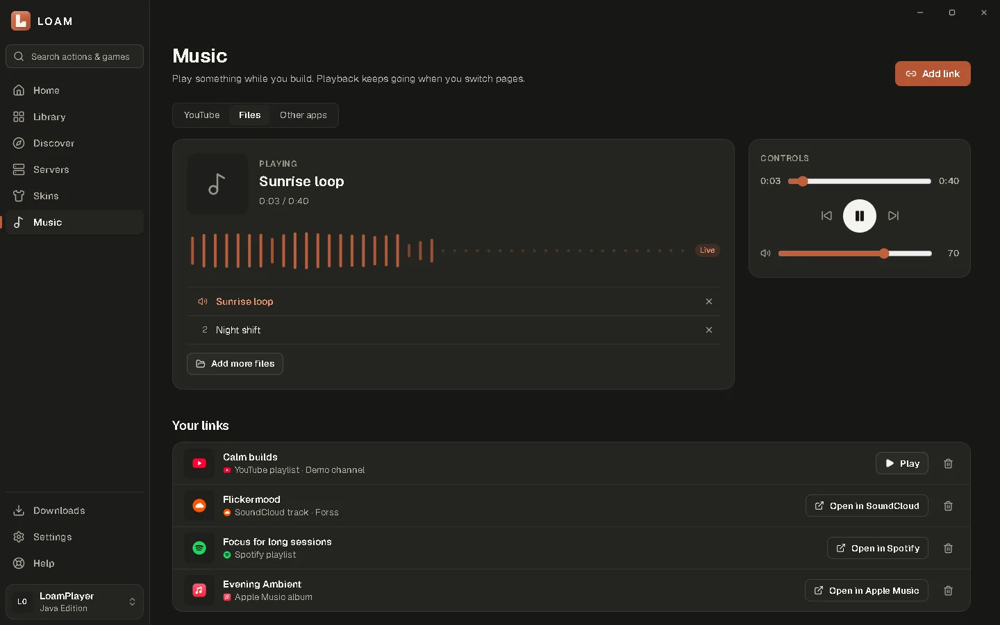
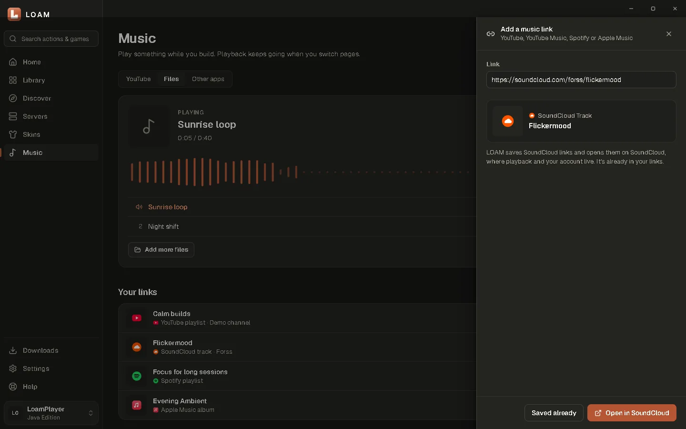
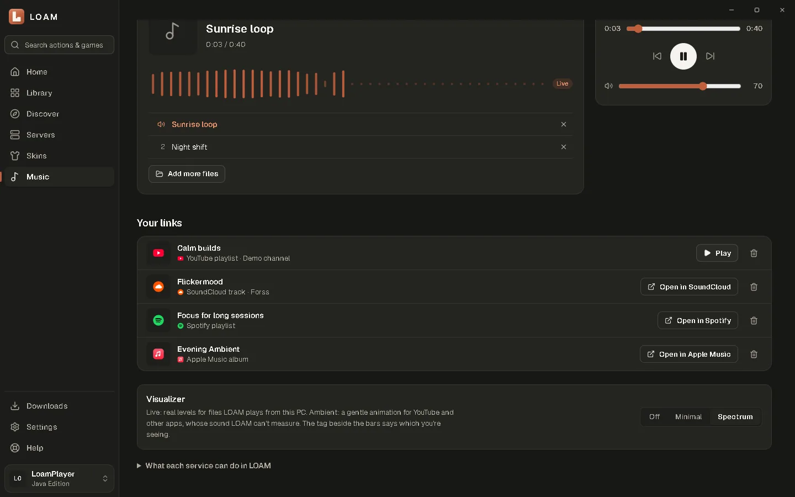
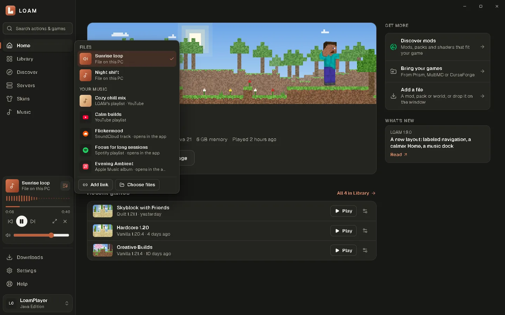
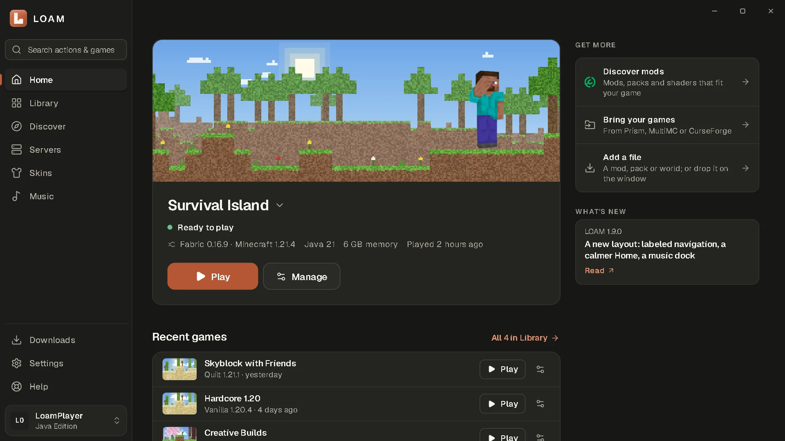
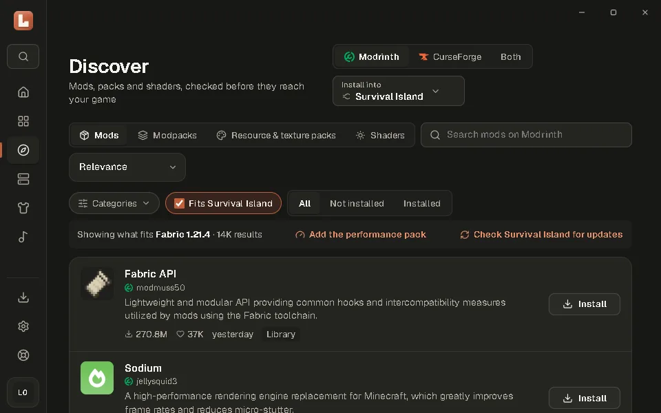
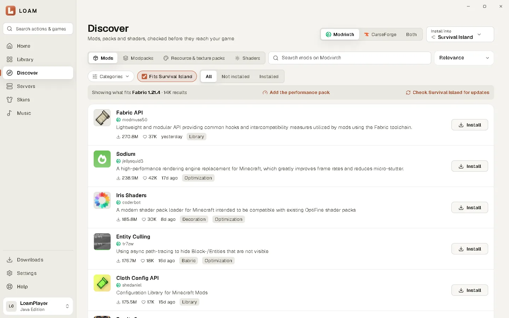
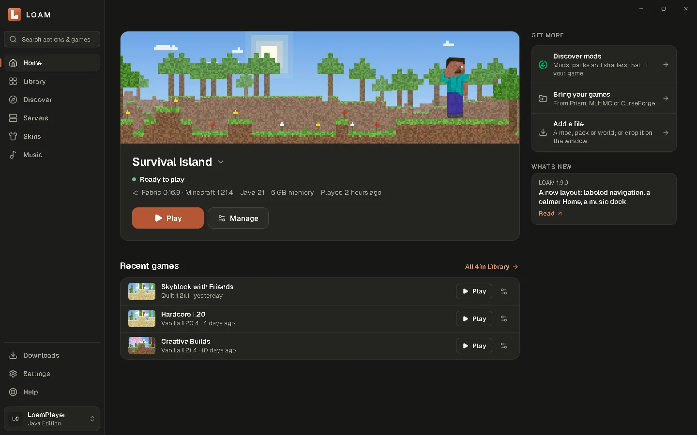

# Launcher polish: Discover installs, music links, scaling and accessibility

**Branch:** `feature/launcher-polish` · **Base:** `master` · **Status:** draft, for review. Please don't merge or publish a release from this PR.

This branch carries the 1.7–1.9 work already on `release/1.6.1`: the redesign, the music player, the Discover filters, server game modes, pixel landscapes and the first-run tour. On top of that it adds the four commits below, which complete the items in the improvement brief.

| Commit | What it does |
|---|---|
| `11353ce` | Discover installs: plan preview, Iris for shaders, clean cancel and rollback |
| `19d900c` | Discover details: choose a version, see what will be installed and where, cancel |
| `989d8d0` | Music: SoundCloud links, and a clear Live vs Ambient visualizer |
| `7c85111` | Recommended badge keeps 4.5:1 contrast on the selected version's tint |

## What changed

### Discover: project details, file choice, dependencies, destinations, cancel, recovery

- **Project details:**
  - The drawer shows the license, last update, downloads, categories, and the project's Source, Issues, Wiki and Discord links.
  - It lists every compatible version. The newest release is marked Recommended, betas and alphas are labelled, and CurseForge-only files are disabled.
  - The player can pick a version; Install (or Create game, for modpacks) uses that version.
- **"Will add to \<game>"** comes from a new `discoverPlan` operation. Before anything downloads, it lists every file, its destination folder (`mods/`, `resourcepacks/`, `shaderpacks/`), its size, which files are required mods, and any notes.
- **Shaders get Iris:** a shader pack now adds Iris, and Sodium (which Iris requires), when the game has neither. Previously a shader pack installed without them and couldn't load.
- **Cancel:** available in the result list and in the details panel. A cancelled install now says nothing was changed.
- **Recovery:**
  - The staging folder is removed on every exit, including cancel and download failure. It used to be left behind in `cache/content`.
  - If moving a verified file into the game fails part-way, files already moved are taken back out and the manifest is untouched. A game is never left half-installed.
- **Filters:**
  - Minecraft version and loader can be set by hand when results aren't fitted to a game. For CurseForge, the loader filter applies only when a Minecraft version is also chosen, which is how its API works.
  - Installed state is a three-way choice: All, Not installed, or Installed.
  - Filters are remembered and shown as removable chips.

### Music

- **SoundCloud** tracks, sets and profiles are recognised:
  - only exact hosts match, and site pages such as `/discover` and `/likes` are excluded;
  - `on.soundcloud.com` short links are followed;
  - title, artist and artwork come from SoundCloud's oEmbed;
  - links open on SoundCloud.
- **Spotify and Apple Music** stay "Open in Spotify" and "Open in Apple Music". Spotify documents its embed player for "a website you control", and its terms don't clearly cover a desktop app's webview. Apple Music playback inside an app needs a MusicKit developer token, which LOAM doesn't have. The capability table on the Music page says this.
- **The visualizer says what it is:**
  - The **Live** spectrum appears for files LOAM plays itself. It's read from Web Audio's analyser, in solid accent colour, with a "Live" tag.
  - The **Ambient** animation appears for YouTube and other apps. It follows play and pause, not the sound, in a softer tint, with an "Ambient" tag and a tooltip that says so.
  - LOAM still never captures system audio.

### Polish

- The new filter selects no longer pick up the content area's generic field styling.
- An `sr-only` utility now exists. There wasn't one before, so visually hidden labels were showing.
- The Recommended badge uses a solid fill, so it passes contrast on the selected row in dark mode.

## Screenshots

All captures come from this branch in demo mode (sample games, no personal data).

| | |
|---|---|
|  |  |
| Discover details: license, links, versions with Recommended | Version and loader filters, chips, All/Not installed/Installed |
|  |  |
| Files from this PC with the Live spectrum | Add link recognises SoundCloud and says what will happen |
|  |  |
| Saved links (YouTube, SoundCloud, Spotify, Apple Music) | One player card in the sidebar, with the playlist switcher |
|  |  |
| 1920×1080 at 150% Windows scaling (1280×720 CSS, 1.5× pixels) | Minimum window, 960×600 |
|  |  |
| Light theme | OLED Black theme |

The full set is in [`screens/`](screens/): every page in Dark at 1440×900; Home, Discover and Servers at 150% scaling; Home, Discover and Music at the minimum window; and Home and Discover in Light and OLED.

## Testing

| Check | Result |
|---|---|
| `cargo clippy --all-targets -- -D warnings` | Clean |
| `cargo test --lib` | 61 passed. New: staging cleanup on every exit; Iris detection by manifest or jar; SoundCloud host matching |
| `npm test` | 43 passed. New: SoundCloud parsing (tracks, sets, profiles, short links, excluded pages, artwork host) |
| `tsc --noEmit` | Clean |
| **Live QA** `cargo run --example qa_install` | **20 checks passed** against the live Modrinth API in an isolated data folder ([log](qa_install.log)). It covers documented search facets, the plan preview (shader goes to `shaderpacks/`, Iris and Sodium to `mods/`), rollback after a forced mid-commit failure, cancel mid-download, a full install landing in the right folders, the installed-state record, and a clean staging folder. |
| Horizontal overflow, all 9 pages | None at 960×600, 1093×614, 1280×720, 1536×864, 1707×960 and 1920×1080, plus the "Large" interface size at 960×600 and 1280×720. These are the CSS sizes Windows gives at 100–200% scaling. |
| axe-core, WCAG 2.2 AA | 0 violations on all 9 pages in Dark and in Light. Also 0 with the Discover details drawer, the version/loader filters and the Add link sheet open, in both themes, after the badge fix. |
| Interaction smoke run | 24 flows with no runtime errors: every page; account switcher; Manage; Discover details, categories, kinds and filters; server details, modes and offline filter; Music tabs, Add link and visualizer modes; all 9 Settings sections; tour replay; command palette; Light and OLED |

**Provider documentation checked on 2026-10-08:**
- [Modrinth search](https://docs.modrinth.com/api/operations/searchprojects/): facets AND/OR, `project_type` values, loaders filed under categories.
- [CurseForge REST API](https://docs.curseforge.com/rest-api/): `ModLoaderType` 1 Forge / 4 Fabric / 5 Quilt / 6 NeoForge; `FileRelationType` 3 = required dependency; `modLoaderType` must be paired with `gameVersion`; `/v1/categories`.
- [Spotify Embeds](https://developer.spotify.com/documentation/embeds).
- SoundCloud oEmbed, tried live.

## Not verified, and blockers

- **CurseForge live path:** not exercised, because no CurseForge API key was available. The code follows the documented enums.
- **Real Windows display scaling:** checked by viewport and pixel-density emulation in Chromium (the same engine as WebView2), not on physical 125–200% displays.
- **Plan preview in the app UI:** the screenshots come from the browser preview, which can't call the Rust backend. The plan itself is verified by the live QA above.
- **No clean-VM install test** of a new installer.
- **Push and pull request:** this repository has no GitHub remote. The branch is ready to push to a **private** repository once one is configured. It must not go to the public `majordhyan/loam-launcher` repo, which holds only docs and releases.
