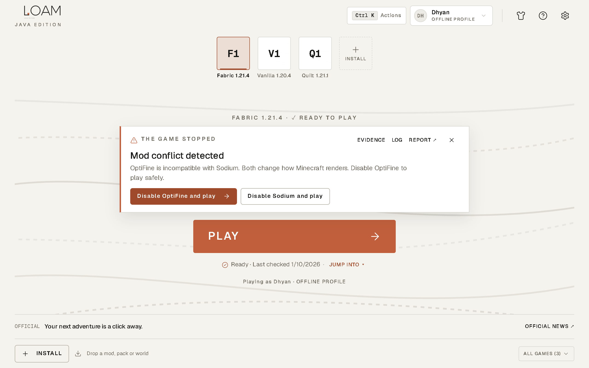

# Troubleshooting

## The game stopped: read the crash card first

When Minecraft exits with an error, LOAM 1.6.1 reads the game's log and newest crash report on your PC and shows one card in place of the version number. Nothing is uploaded.

| The card says | Fix it offers |
| :--- | :--- |
| **A required mod is missing** (e.g. "Iris needs Sodium (0.6.x)") | Find the missing mod on Modrinth, or disable the mod that needs it and play |
| **A mod needs a different version of another mod** | Disable the dependent mod and play; update the other mod |
| **Mod conflict detected** (including OptiFine with Sodium or Iris) | Disable one of the two and play |
| **The same mod is installed twice** | Disable the extra copy and play |
| **A mod is not compatible with this game version** (mixin failure) | Disable that mod and play |
| **A mod needs a newer Java** | Use a version of the mod made for this Minecraft version |
| **Minecraft ran out of memory** | Give the game more memory and play |
| **Not enough free memory to start** | Use less memory and play |
| **Java rejected a launch option** | Open Game settings to remove custom JVM options |
| **Graphics driver problem** | Update your GPU driver (NVIDIA, AMD or Intel); try without shaders |

"Disable" renames the mod to `.jar.disabled`, so you can turn it back on from **Game details → Content**. Use **Evidence** to see the exact log line, **Log** for the full log, and **Report** to prepare a redacted report.

If LOAM doesn't recognise a crash, it says so. Check **Game details → Logs**, and send a report.

> Fabric shows its own error window for missing or conflicting mods. LOAM's card appears after you close that window.

## Minecraft 1.17 to 1.20.4 won't start (LOAM 1.5.x)

Fixed in 1.6.1. Install the [latest release](https://github.com/majordhyan/loam-launcher/releases/latest).

## Windows SmartScreen warns about the installer

LOAM isn't code-signed yet. Check the SHA-256 (see [Installation](installation.md)), then choose **More info → Run anyway**.

## LOAM won't open

1. On Windows 10, install the [WebView2 Runtime](https://developer.microsoft.com/microsoft-edge/webview2/).
2. Reinstall the [latest release](https://github.com/majordhyan/loam-launcher/releases/latest). Your games and settings are kept.
3. If you moved your data folder to another drive, reconnect that drive.

## A game won't install

- Check your connection; LOAM resumes interrupted downloads when you press **Install** again.
- Free up space: the review screen shows how much is needed.
- Use **Game details → Verify / reinstall** to re-check every file. Worlds are never touched.

## Microsoft sign-in fails

- Sign in with the Microsoft account that owns Minecraft: Java Edition.
- "No Java profile exists": set your Java username at minecraft.net, then sign in again.
- "Xbox authorization was declined": check your Xbox profile, region and family settings at xbox.com.
- Make sure no firewall or browser extension blocks `localhost`, which receives the sign-in result.
- Still stuck: remove the account in LOAM and add it again.

## Mods don't load

- The game must use Fabric or Quilt and the same Minecraft version as the mod. Smart Drop tells you when it doesn't.
- Forge and NeoForge mods don't run in LOAM.

## Get help

Press `F1` → **Start a report**. LOAM prepares a report with tokens, e-mail addresses and your Windows user name removed. Preview it, then copy it or save the diagnostics ZIP and attach it to a [bug report](https://github.com/majordhyan/loam-launcher/issues/new?template=bug_report.yml), [Discord](https://discord.gg/7ft7ZJ9brd) or an e-mail to loamlauncher@gmail.com.

*Back to [README](../README.md) · [FAQ](faq.md)*
